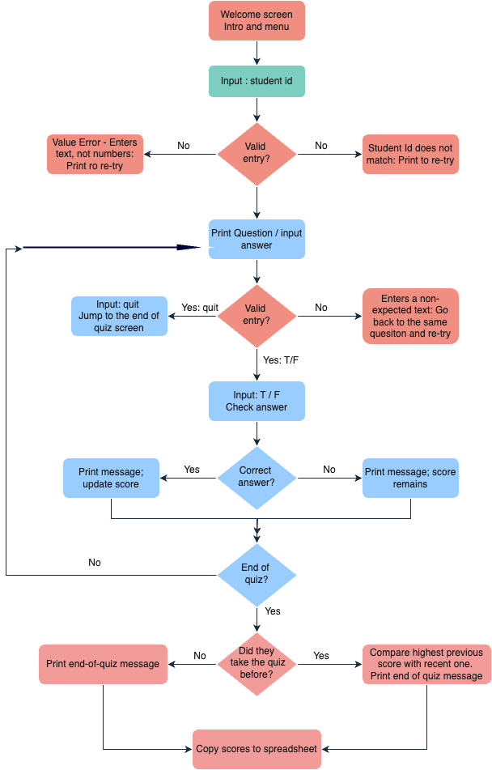
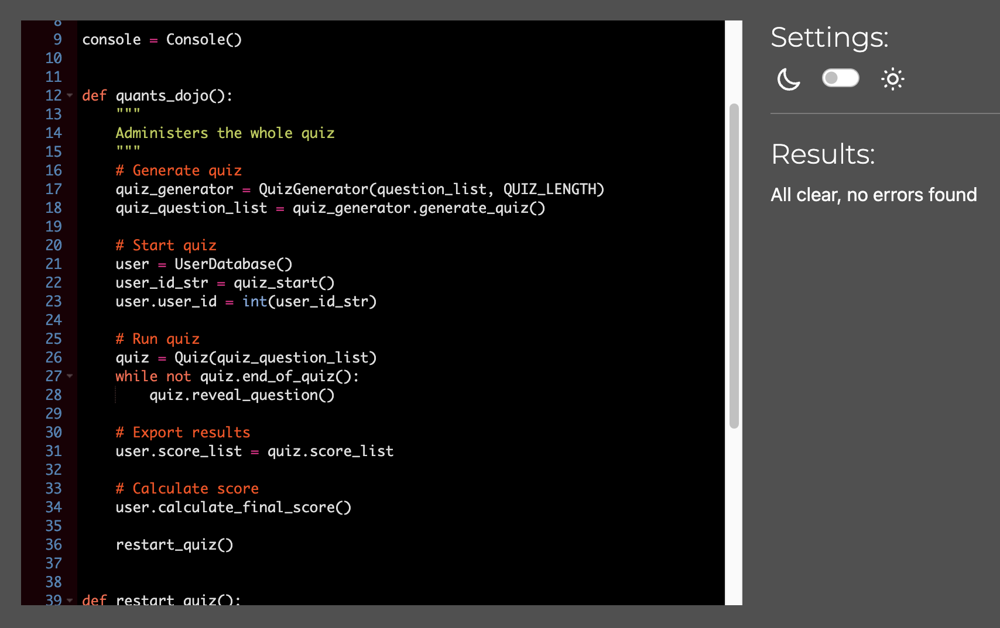
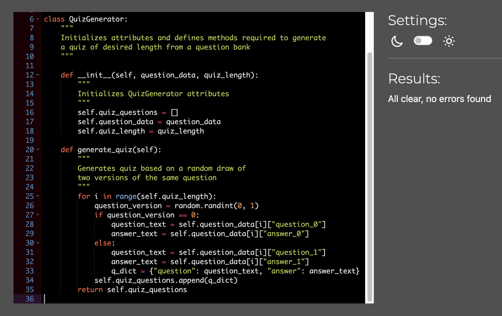
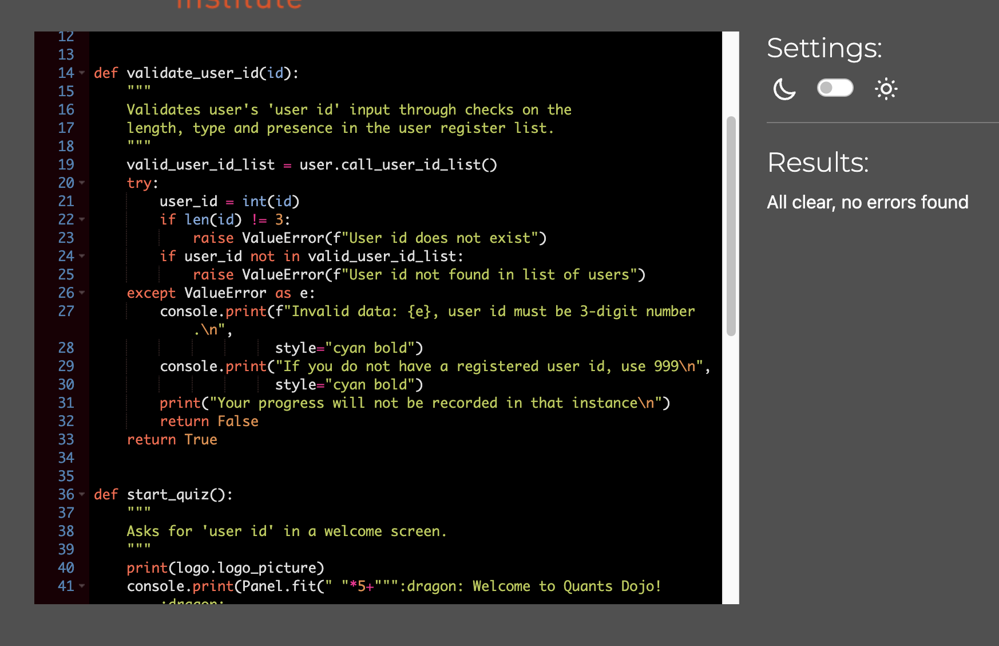
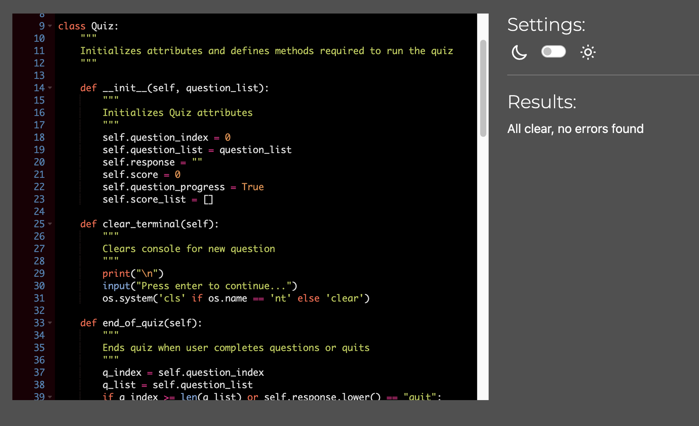
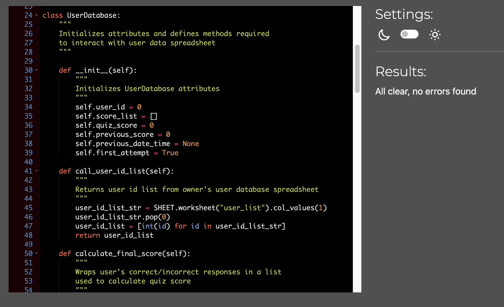

Welcome,

This is the Code Institute student template for deploying your third portfolio project, the Python command-line project. The last update to this file was: **May 14, 2024**

## Reminders

- Your code must be placed in the `run.py` file
- Your dependencies must be placed in the `requirements.txt` file
- Do not edit any of the other files or your code may not deploy properly

## Creating the Heroku app

When you create the app, you will need to add two buildpacks from the _Settings_ tab. The ordering is as follows:

1. `heroku/python`
2. `heroku/nodejs`

You must then create a _Config Var_ called `PORT`. Set this to `8000`

If you have credentials, such as in the Love Sandwiches project, you must create another _Config Var_ called `CREDS` and paste the JSON into the value field.

Connect your GitHub repository and deploy as normal.

## Constraints

The deployment terminal is set to 80 columns by 24 rows. That means that each line of text needs to be 80 characters or less otherwise it will be wrapped onto a second line.

---

Happy coding!

# Quants Dojo

Quants Dojo is a game-like True/False quiz designed for learners of Econometrics at the beginner to intermediate level. It is designed to test user's knowledge in certain concepts in Econometrics and help them practice and learn as they answer questions.

Through an API connection to a Google Drive spreadsheet, tracking of user performance for each question in each of their attempt also helps the instructors (which will be referred to as the "owner" from this point onwards) to track the progress of the learners and in which topics they tend to struggle the most.

The quiz consists of 10 questions. These are designed to test and clarify the confusions about the most commonly made mistakes by the learners.

Each concept tested is phrased in two alternative ways: (i) the correct answer is `True`; (ii) the correct answer is `False`. The true and false versions of each concept being tested is chosen randomly. This will ensure a different combination of questions each time the quiz is called by a user. Because it is only the phrasing of the concept that is being changed (rather than a random selection of questions from a wider pool), changes in user's performance will be measured accurately by tracking the scores posted on spreadsheet.

The quiz questions are created once the user provides a correct id. The valid id's for testing purposes are listed below:
  - 123, 234, 345, 456, 567, 678, 789, 890, 912.
  - 999 is also listed as one of the registered `user id`'s, allowing for a guest access. This makes it possible for a person outside the user registry to attempt the quiz.

## App's Location:

- Live link:
  - Quants Dojo < https://quants-dojo-20a4c624877b.herokuapp.com/ >

- GitHub Repository: 
  - quants_dojo < https://github.com/hisarciklilar/quants_dojo/ >

## Existing Features

### Quiz Start

- Quiz starts with a picture and a welcome message. It asks for the user's input for `user id`
- The registered `user id`'s are stored in a spreadsheet on Google Drive. The valid id's for testing purposes are listed below:
  - 123, 234, 345, 456, 567, 678, 789, 890, 912.
  - 999 is also listed as one of the registered `user id`'s, allowing for a guest access. This makes it possible for a person outside the user registry to attempt the quiz.
- The second page has the quiz logo. It provides brief information about the quiz and user instructions.
  
### Quiz Generator Module

- Allows the owner of the platform to choose the quiz length
- Each True/False question in the question bank is phrased in two alternative ways, one with "True" as the correct answer and the other alternative version with "False" as the correct answer. The QuizGenerator randomly selects from these two alternatives while appending each question to the quiz question list. In this way, it becomes highly unlikely for the user to work on the exact same quiz in repeated attempts.

### Quiz Module

- Starts with clearing the welcome screen and presents the question. The screen is cleared for better focus when revealing the next question.
- Allows users to quit if they want to before the completion of the quiz.
- User receives immediate feedback after submitting their answer. The feedback includes:
  - a message stating 'correct' or 'incorrect' with a relevant emoji
  - what the correct answer was
  - the number of correct answers and the number of total questions answered up to the point of progress.
  - Current score calculated based on the questions answered up to that point
- Saves a list of individual question scores as user proceeds in the quiz. This list of responses are coded as 'zero' for the wrong and as 'one' for the correct user answers. This allows for easy data store and also a straightforward calculation of the quiz score.
- In case of a user quitting before the end of survey, scores up until quit are still recorded in a list, adding 'zero' point to the questions not answered (those which would be listed post-quit). These scores are written into the spreadsheet through API connection.
- Particular sections of the question screen are color-coded such as the question number, the words `True` and `False`, number of questions, and the current score.  
- User moves on to the next question by pressing enter, which clears the screen for the next question. Users also have the choice of quitting the quiz by typing `quit`.
- User receives a value error if they type anything other than `True` or `False`.
- Feedback is provided on the performance and the number of questions answered as the user progresses in the quiz. The score up to the point of progress is also calculated and printed to console after user's response to each question.
- Correct and incorrect answers are indicated to the user through text and an emoji.
- A quiz score is calculated and printed on console at the end of the quiz. If the user is revisiting the site, their latest previous score together with the date of attempt is also printed to the console and a comparison of scores is provided with an appropriate emoji.
- At the very end, the user is given the option to go back to the quiz start.
  
### API Connection

- A spreadsheet saved in Google Drive is holding information on two worksheets: The `user_list` worksheet includes a list of registered `user id`'s who are expected to take the quiz while `quiz_response` worksheet tracks the performance of users for each question and the date-time they attempt the quiz. Tracking scores for each question allows the owner to analyze which questions the users struggle with the most.  
- For revisiting users, the previous scores are called from the speadsheet and the most recent previous score is compared with the current score.

## Future Features

- Creating a data bank of questions for different topics and allow the users to choose in which topic they test their skills.
- For those who genuinely do not know their user id, add a user option to exit the quiz during validation.
- Add a time stamp for completion of the quiz
- Comparison with the latest previous score and giving feedback

## Flowchart

Below is a flowchart that I created before I started the coding. The final code produced follows this logic. 

## Things to do

- Work in the code for easy ready - in particular while importing packages
- Clean redundant lines
- check for the definitions before submission
- Insert the flow chart
- indent the text

## Manual Testing

### Quiz Start

| FEATURE BEING TESTED            | TESTING PERFORMED                                | EXPECTATION                              | RESULT    |
|------------------------|---------------------------------------|------------------------------------------|-----------|
| User id input   | User presses `enter` without typing  | ValueError raised reminding user to input a number with 3 digits        | Pass |
| User id input | User types a number with more than 3 digits | A ValueError is raised reminding user to input a number with 3 digits | Pass |
| User id input | User inputs a non-numeric value | ValueError raised reminding user to input a number with 3 digits        | Pass |
| User id input | User inputs a valid 3 digit number but with space around (on left or right) | Quiz proceeds to next page; correct id is recorded on spreadsheet | Pass |
| User id input | User inputs a number with 3 digits that is not in the user register list | A message tells the user to input a value that is in the register list, but also giving them the option to use 999 if they are not registered | Pass |

### Quiz

| FEATURE BEING TESTED            | TESTING PERFORMED                                | EXPECTATION                              | RESULT    |
|------------------------|---------------------------------------|------------------------------------------|-----------|
| Correctly receive user input of `True` or `False`| Type true or false in various combinations using lower case and capital letters as well as space on left and right of the word  | Accepts the input and triggers calculation of a score, which is presented on screen | Pass |
| Rejection of keyboard entries other than `True` and `False` | Type different combinations of letter and numbers as an input | User receives a Value Error with a reminder of the valid responses; screen clears and prints the same question on enter for the user to respond | Pass |
| Rejection of keyboard entries other than `True` and `False` | Press enter without typing any answer | User receives a Value Error with a reminder of the valid responses; screen clears and prints the same question on enter for the user to respond | Pass |
| Question number increments| Moving along the quiz providing different combinations of answers | Displayed question number increasing by one as user moves on to the next question | Pass |
| Counts of correct answers and questions responded | Moving along the quiz providing different combinations of answers | Correct counting of correct answers and questions responded | Pass |
|Current score calculation | Moving along the quiz providing different combinations of answers | Correct calculation of score up to the point of progress | Pass |

### End of Quiz

| FEATURE BEING TESTED            | TESTING PERFORMED                                | EXPECTATION                              | RESULT    |
|------------------------|---------------------------------------|------------------------------------------|-----------|
| Quiz results information | Answered all questions in quiz as a first attempt | Quiz score printed correctly on terminal | Pass |
| Quiz results information | Answered all questions in quiz as a revisiting user | Quiz score printed correctly on terminal | Pass |
| Previous score information | Answered all questions in quiz as a revisiting user | Latest previous quiz score and date-time of attempt printed correctly on terminal | Pass |
| Previous score information | Answered all questions in quiz as first attempt | No mentioning of a previous quiz score on terminal. A message is printed instead encouraging user to come back | Pass |
| Feedback based on comparison of current and previous scores | Took the quiz as a re-visiting user | A feedback is produced and displayed based on a comparison of current and latest previous scores with a relevant emoji | Pass|
| Go back to start  | Pressed enter in response to 'Restart quiz?' question provided in the very end | Screen returns to start of the quiz on `Enter` | Pass |

### User Database API Connection

| FEATURE BEING TESTED            | TESTING PERFORMED                                | EXPECTATION                              | RESULT    |
|------------------------|---------------------------------------|------------------------------------------|-----------|
| API connection | Data from each of the two worksheets are called and saved as lists during programming of the quiz | Correct data is exported in list format | Pass |
| API connection | Writing of user-specific data to `quiz_response` worksheet | User id's, user's quiz performance for each question, total quiz score and the date-time of attempt are written to rows in worksheet | Pass | 

### Operating Systems

- The app runs without issues on:
  - Google Chrome, on Mac, Linux and Windows
  - Firefox on Linux
  - Android phone
- It fails to run on
  - Mac Safari
  - iPhone Safari and Google

## Code Institute Python Linter

### run.py

### quiz_generator.py

### quiz_start.py

### quiz.py

There are two `E203 whitespace before ','` warnings on this file, but I could not spot the issue for fixing.

### user_database.py

## Bugs

- Code written in a way that owner can choose the quiz length. In the current form, the quiz length is set to be 10 questions with a global variable. The spreadsheet created on google drive is designed to hold information for 10 questions. If the owner changes the value of the QUIZ_LENGTH variable to a different value, the functions will run, but the scores written to the spreadsheets will be labelled wrong in spreadsheet. One way to get around this issue would be to re-create a worksheet that would match the set quiz length.
- Registered users may use code 999 to practice and then come back to take it using their own id's. Though this is a bug, implications on learning is not bad. Users will learn as they practice.  
- At the end of the quiz, printing of quiz results in the panel produces extra space on the left, which I failed to get rid of.  

## Deploying the app on Heroku

## Credits

### ASCII Art

- [ASCII](https://ascii.co.uk) is used for the logo text and logo picture.
  - Logo text: Chosen font type: "stop",
  - Logo image: Cropped from "temples" image.

### Python's Rich Module

- Thanks to my mentor Matt Bodden for directing me to this module
- Color, formatting and emoji insertions are done through the `Rich Module`. 
  - Install the module using `pip install rich`
  - On terminal, type `python -m rich` to access manual
  - Documentation is provided on < https://github.com/textualize >. 
- Usage examples and explanations: 
  - [Python Rich YouTube Video by DevOps Journey](https://www.youtube.com/watch?v=JrGFQp9njas)
  - Chat GPT and Microsoft Co-Pilot for Rich Module Progress Bar
  