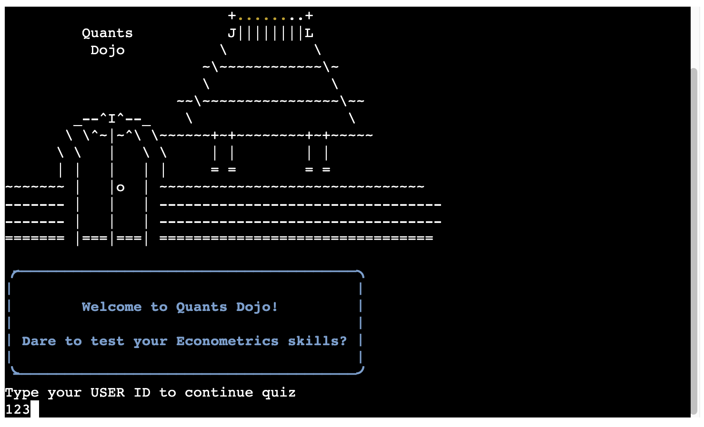
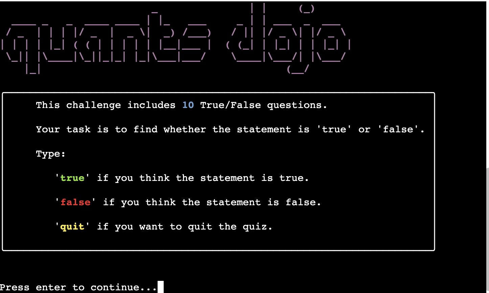

# Quants Dojo

Quants Dojo is a game-like True/False quiz designed for learners of Econometrics at the beginner to intermediate level. It is designed to test user's knowledge in certain concepts in Econometrics and help them practice and learn as they answer questions.

Through an API connection to a Google Drive spreadsheet, tracking of user performance for each question in each of their attempt also helps the instructors (which will be referred to as the "owner" from this point onwards) to track the progress of the learners and in which topics they tend to struggle the most.

The quiz consists of 10 questions. These are designed to test and clarify the confusions about the most commonly made mistakes by the learners.

Each concept tested is phrased in two alternative ways: (i) the correct answer is `True`; (ii) the correct answer is `False`. The true and false versions of each concept being tested is chosen randomly. This will ensure a different combination of questions each time the quiz is called by a user. Because it is only the phrasing of the concept that is being changed (rather than a random selection of questions from a wider pool), changes in user's performance will be measured accurately by tracking the scores posted on spreadsheet.

The quiz questions are created once the user provides a correct id. The valid id's for testing purposes are listed below:
  - 123, 234, 345, 456, 567, 678, 789, 890, 912.
  - 999 is also listed as one of the registered `user id`'s, allowing for a guest access. This makes it possible for a person outside the user registry to attempt the quiz.

The app is created using Code Institutes Python Project template, which can be obtained from <https://github.com/Code-Institute-Org/p3-template>

## App's Location:

- Quants Dojo Live link: 
  -  <https://quants-dojo-20a4c624877b.herokuapp.com/>

- quants_dojo GitHub Repository: 
  -  <https://github.com/hisarciklilar/quants_dojo/>

_Note_: Above images are obtained through http://ami.responsivedesign.is/

## User Experience

The target audience for this website are UG students of social sciences, who are half-way through their degree.

### User Stories

Users of this web application expect the following:

- Navigate around the site easily without frustration.
- Easily read and understand the information provided in the pages.
- Receive immediate feedback about their performance on individual questions as well as an overall quiz score.
- Receive immediate feedback about the change in their progress over time.

### App Owner's Goals

- To break the anxiety around learning and application of econometrics by providing fun routes to learning
- Track the attempts (frequency and dates) of each user to have a better understanding of their work patterns.
- Develop an understanding of the topics/concepts that the users most struggle with

## Existing Features

### Quiz Start

- The quiz is designed with an assumption that the owner has a list of registered users in a spreadsheet. It starts with an ASCII image and a welcome message. Below these, it asks for the user's input for `user id`
- The registered `user id`'s are stored in a spreadsheet on Google Drive. User's input is checked against the register on the worksheet. Their progress is tracked and recorded throughout the quiz.
  
- Guest access is possible with a user of 999.
- The second page has the quiz logo. It provides brief information about the quiz and user instructions.

### Quiz Generator Module

- The Quiz Generator allows the owner of the platform to choose the quiz length and store it in a global variable.
- Each True/False question in the question bank is phrased in two alternative ways, one with "True" as the correct answer and the other alternative version with "False" as the correct answer. The QuizGenerator randomly selects from these two alternatives while appending each question to the quiz question list. In this way, it becomes highly unlikely for the user to work on the exact same quiz in repeated attempts.

### Quiz Module

- Following the user id check and instructions, the quiz starts with presenting the questions. One question is presented at a time, by clearing the screen for a better focus.
- Users move on to the next question by pressing enter, which clears the screen for the next question. Users also have the choice of quitting the quiz by typing `quit`.
- The user receives a value error if they type anything other than `True` or `False`.
- Particular sections of the question screen are color-coded such as the question number, the words `True` and `False`, number of questions, and the current score.
- User receives immediate feedback after submitting their answer. The feedback includes:
  - a message stating 'correct' or 'incorrect' with a relevant emoji
  - what the correct answer was
  - the number of correct answers and the number of total questions answered up to the point of progress.
  - Current score calculated based on the questions answered up to that point
- Saves a list of individual question scores as user proceeds in the quiz. This list of responses are coded as 'zero' for the wrong and as 'one' for the correct user answers. This allows for easy data store and also a straightforward calculation of the quiz score.
- In the case of a user quitting before the end of survey, scores up until quit are still recorded in a list, adding 'zero' point to the questions not answered (those which would be listed post-quit).
- A quiz score is calculated and printed on console at the end of the quiz. If the user is revisiting the site, their latest previous score together with the date of attempt is also printed to the console and a comparison of scores is provided with an appropriate emoji.
- A progress bar is provided at the end of the quiz, running through the final calculations and tasks.
- At the very end, the user is given the option to go back to the quiz start.
- Scores are written into the spreadsheet through API connection.

### API Connection

- A spreadsheet saved in Google Drive is holding information on two worksheets: The `user_list` worksheet includes a list of registered `user id`'s who are expected to take the quiz while `quiz_response` worksheet tracks the performance of users for each question and the date-time they attempt the quiz. Tracking scores for each question allows the owner to analyze which questions the users struggle with the most.  
- For revisiting users, the previous scores are called from the speadsheet and the most recent previous score is compared with the current score.

## Data Model

The code for the app is a mixture of procedural and Object Oriented Programming (OOP), with more weight on OOP. There are three modules created for this app, each working in collaboration.

### Module 1 - Quiz Generator

This is a relatively smaller module that is designed to create the quiz by randomly selecting a version of the question from an existing question data bank.

- Attributes:
  - quiz_questions (_list_)
  - question_data (_list of dictionaries_)
  - quiz_length (_global integer_)
- Method:
  - generate_quiz
  
### Module 2 - Quiz

This module performs operations in relation to running the quiz.

- Attributes:
  - question_index (_question list index value_)
  - question_list (_list of selected questions_)
  - response (_response received_)
  - score (_quiz score_)
  - question_progress (_Boolean for quiz progress_)
  - score_list (_list of scores for individual questions_)
  
- Methods:
  - clear_terminal
  - end_of_quiz
  - reveal_question
  - check_answer
  - track_score

### Module 3 - User Database

- Attributes:
  - user_id (_integer, 3 digit_)
  - score_list (_user list of scores for individual questions_)
  - quiz_score (_user quiz score_)
  - previous_score (_user previous quiz score_)
  - previous_date_time (_most recent previous date/time of attempt_)
  - first_attempt (_Boolen for first versus revisiting user_)
- Methods:
  - call_user_id_list
  - calculate_final_score
  - calculate_quiz_score
  - add_date_to_quiz_record
  - call_previous_score
  - print_score
  - provide_feedback

Screenshots of spreadhseet on user information is provided below:

### External Libraries Used:

- `rich`: is integrated into the project to add some color and style to an otherwise black-white screen. It helps to make the look of the quiz more game-like for the user experience
- `gspread`: is used to have API functionality. Communication with a spreadsheet in Google Drive is necessary for this app to access user information and track user progress. 
- `random`: is used for random number generation during the creation of the quiz
- `os` : used to clear screen on enter when questions are being displayed in turn.
- `datetime` is used to stamp the date and time of the user's attemt on the quiz.
- `time`: is used to program the progress bar that shows at the end of the quiz. Something to show the user that calculations are running at the background.

## Future Features

- Creation of a data bank of questions for different topics and allow the users to choose the  topic they want to test their skills.
- Add a well-functioning user database mangement system where users can register and create own usernames and passwords.

## Flowchart

Below is a flowchart that I created before I started the coding. The final code produced follows this logic.

## Manual Testing

### Quiz Start

| FEATURE BEING TESTED | TESTING PERFORMED                           | EXPECTATION                                                           | RESULT |
|----------------------|---------------------------------------------|-----------------------------------------------------------------------|--------|
| User id input        | User presses `enter` without typing         | ValueError raised reminding user to input a number with 3 digits      | Pass   |
| User id input        | User types a number with more than 3 digits | A ValueError is raised reminding user to input a number with 3 digits | Pass   |
| User id input        | User inputs a non-numeric value             | ValueError raised reminding user to input a number with 3 digits      | Pass   |
| User id input        | User inputs a valid 3 digit number but with space around (on left or right) | Quiz proceeds to next page; correct id is recorded on spreadsheet | Pass |
| User id input        | User inputs a number with 3 digits that is not in the user register list | A message tells the user to input a value that is in the register list, but also giving them the option to use 999 if they are not registered | Pass   |

### Quiz

| FEATURE BEING TESTED                             | TESTING PERFORMED                                | EXPECTATION                              | RESULT    |
|--------------------------------------------------|--------------------------------------------------|------------------------------------------|-----------|
| Correctly receive user input of `True` or `False`| Type true or false in various combinations using lower case and capital letters as well as space on left and right of the word  | Accepts the input and triggers calculation of a score, which is presented on screen | Pass |
| Rejection of keyboard entries other than `True` and `False` | Type different combinations of letter and numbers as an input | User receives a Value Error with a reminder of the valid responses; screen clears and prints the same question on enter for the user to respond | Pass |
| Rejection of keyboard entries other than `True` and `False` | Press enter without typing any answer | User receives a Value Error with a reminder of the valid responses; screen clears and prints the same question on enter for the user to respond | Pass |
| Question number increments| Moving along the quiz providing different combinations of answers | Displayed question number increasing by one as user moves on to the next question | Pass |
| Counts of correct answers and questions responded | Moving along the quiz providing different combinations of answers | Correct counting of correct answers and questions responded | Pass |
|Current score calculation | Moving along the quiz providing different combinations of answers | Correct calculation of score up to the point of progress | Pass |

### End of Quiz

| FEATURE BEING TESTED            | TESTING PERFORMED                                | EXPECTATION                              | RESULT    |
|------------------------|---------------------------------------|------------------------------------------|-----------|
| Quiz results information | Answered all questions in quiz as a first attempt | Quiz score printed correctly on terminal | Pass |
| Quiz results information | Answered all questions in quiz as a revisiting user | Quiz score printed correctly on terminal | Pass |
| Previous score information | Answered all questions in quiz as a revisiting user | Latest previous quiz score and date-time of attempt printed correctly on terminal | Pass |
| Previous score information | Answered all questions in quiz as first attempt | No mentioning of a previous quiz score on terminal. A message is printed instead encouraging user to come back | Pass |
| Feedback based on comparison of current and previous scores | Took the quiz as a re-visiting user | A feedback is produced and displayed based on a comparison of current and latest previous scores with a relevant emoji | Pass|
| Go back to start  | Pressed enter in response to 'Restart quiz?' question provided in the very end | Screen returns to start of the quiz on `Enter` | Pass |

### User Database API Connection

| FEATURE BEING TESTED            | TESTING PERFORMED                                | EXPECTATION                              | RESULT    |
|------------------------|---------------------------------------|------------------------------------------|-----------|
| API connection | Data from each of the two worksheets are called and saved as lists during programming of the quiz | Correct data is exported in list format | Pass |
| API connection | Writing of user-specific data to `quiz_response` worksheet | User id's, user's quiz performance for each question, total quiz score and the date-time of attempt are written to rows in worksheet | Pass | 

### Operating Systems

- The app runs without issues on:
  - Google Chrome, on MacOS, Linux and Windows
  - Firefox on Linux
  - Android phone
- It fails to run on
  - MacOS Safari
  - iPhone (iOS) Safari and Google

## Code Institute Python Linter

Code used for the app is validated using the linter provided on <https://pep8ci.herokuapp.com/>. Below are the screenshots of these validations.

### run.py

### quiz_generator.py

### quiz_start.py

### quiz.py

There are two `E203 whitespace before ','` warnings on this file, but I could not spot the issue for fixing.

### user_database.py

## Bugs

- The code for the app is written in a way that the owner can choose the quiz length. This is an advantage. However, the spreadsheet created on google drive is designed to hold information for 10 questions. If the owner changes the value of the QUIZ_LENGTH variable from 10 to a different value, the functions will run, but the scores written to the spreadsheets will be labelled wrong in spreadsheet. One way to get around this issue would be to re-create a worksheet that would match the set quiz length.A better way to do it is to integrate creation of the spreadsheet to the program.
- Registered users may use code 999 (instead of their own) to practice and then come back to take the quiz using their own id's, leading to misleading understanding abut their performance. Though this is a bug, implications on learning is not bad. Users will learn as they practice.  
- The user experience would have been much better if the images and text could propoerly be centered in the terminal screen. In the current form, all information is heavily placed on the left. the question length is also difficult to limit or adjust, which may result in the displayed question being split in middle and moving on to the next line.  

## Deploying the app on Heroku

Below are the steps that need to be followed for deployment. See [ReadMe Appendix Deployment](./readme_assets/ReadMe_Appendix_Deployment.md) for more information with screenshots.

- Place the main code for running the app in the `run.py` file
- Place the dependencies in the `requirements.txt` file using `pip3 freeze > requirements.txt`. 
- Create an account on Heroku
- Click on the `Create New App` button
- Provide an app name and choose location: Europe for residents of Europe.
- Go to `Settings` tab.
- In the `Config Vars` section, click on `Reveal Config Vars` button.
- In the `KEY` field, type in capital letters `CREDS`. In the `VALUE` field, copy-paste the contents of the `creds.json` file
- In the new `KEY` field that appears below, type `PORT` and type `8000` in the corresponding value field
- Click `Add buildpack` button. Two buildpanks will be needed:
  
  1. `heroku/python`
  2. `heroku/nodejs`

    Ensure that Python is listed before nodejs.

- Find and select `python` from the officially supported buildpacks. Click `Add buildpack` button.
- Do the same for `nodejs`.
- Go to `Deploy` tab on top. Choose `GitHub` as the `Deployment method`. Heroku will try to establish a conneciton with GitHub account. Authorize the connection.
- Search for the repository name that you want to deploy and click `connect`.
- Choose `Deploy branch` for manual deployment, where one can see the progress of deployment. Click `Enable Automatic Deploys` for automatic deplomyment. This will update the files as GitHub is being updated.  

## Creating a Fork

On GitHub, users may fork this repository by navigating to "Fork" and selecting "Create a new fork". One cannot fork from their repository. Hence, below, a screenshot of how this could be done are provided using a repository created by a different user:

## Cloning a Repository

Users may clone this repository by navigating to "Code" and copying the clone link. This link then can be used in Gitpod or a local code editor.  A screenshot of the links are provided below:

(Please note this is not the only way to clone a repository)

## Establishing an API connection

As of November 2024, below are the steps that need to be followed for establishing an API connection with a Google sheet document. See [ReadMe Appendix API Connection](./readme_assets/ReadMe_Appendix_Deployment.md) for more information with screenshots.

- Login to `Google Cloud` and select `New Project`. Link to Google Cloud Platform <https://console.cloud.google.com/>
- Give project a name and click `Create`
- From the left-hand-side menu, choose `APIs and services` and select `Library`
- Search for the `Google Drive API` in the `API Library`
- Select `Google Drive API` and click `Enable`
- As `Google Drive API` is selected, click on the `Create Credentials` button
- Under `Which API are you using?`, choose `Google Drive API` and select `Application data`. Click `Next`.
- Under `Service account details`, provide a `Service account name`. You will see a `Service account ID` being created with an email address for service account. Click `Create and Continue`.
- Under `Grant this service account to the poject`, choose `Project` and `Editor` as role.
- Under `Credential`, `Service Accounts`, choose the account you would like to work with.
- Under `Service accounts`, ensure service account is enabled.
- Under `Service accounts`, select the `KEY` tab on top and then on the `KEY` page, select `ADD KEY` --> `Create new key`.
- In the opening window, choose `JSON` as the `Key type`.
- Once this is complete, go to `APIs and services` again and choose `Library`.
- This time search for `Google Sheets API`. Select and `Enable` `Google Sheets API`.
- Once your `JSON` file is downloaded, copy this into your project folder and rename it as `creds.json`. Add this file to `.gitignore` so that private sensitive information is not chared with public.
- Open the `creds.json` file and copy the `client_email` address to clipboard. Paste this address on the Google sheet's `Share` window. Confirm share. This will allow to establish a connection between the workspace and Google sheet.
  
## Credits

### ASCII Art

ASCII Art was used to make the look of the app more interesting. It is hope that this will take the attention of the potential users.

- [ASCII](https://ascii.co.uk) is used for the logo text and logo picture.
  - Logo text: Chosen font type: "stop",
  - Logo image: Cropped from "temples" image.

### Python's Rich Module

- Thanks to my mentor Matt Bodden for directing me to this module
- Color, formatting and emoji insertions are done through the `Rich Module`. 
  - Install the module using `pip install rich`
  - On terminal, type `python -m rich` to access manual
  - Documentation is provided on < https://github.com/textualize >. 
- Usage examples and explanations: 
  - [Python Rich YouTube Video by DevOps Journey](https://www.youtube.com/watch?v=JrGFQp9njas)
  - Chat GPT and Microsoft Co-Pilot for Rich Module Progress Bar
  
### Templates

- Code Institute