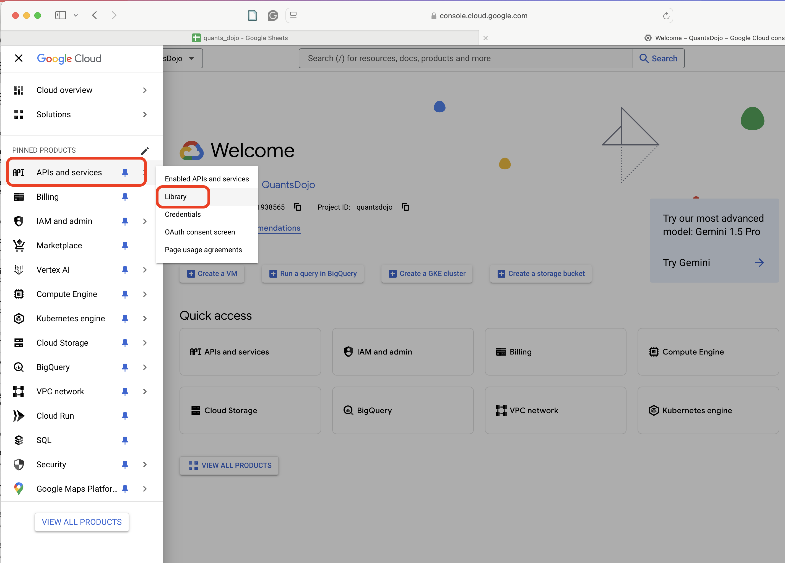
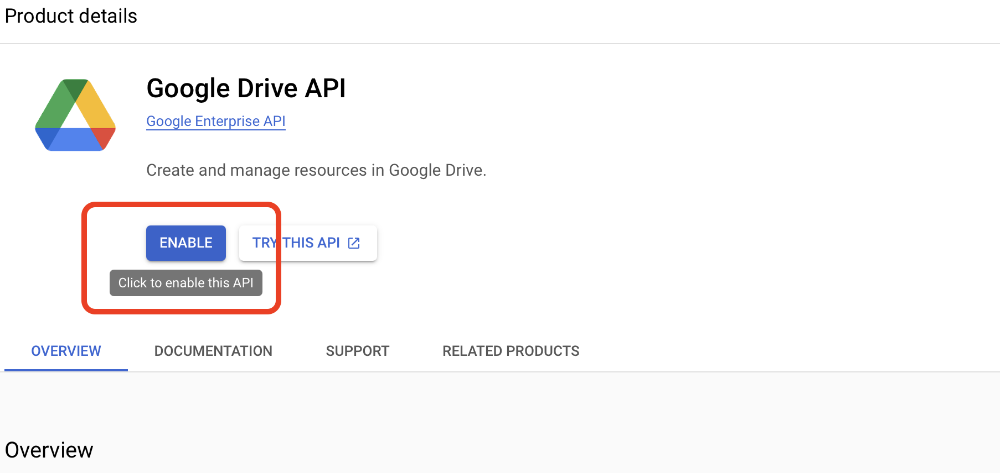

# Establishing an API connection

As of November 2024, below are the steps that need to be followed for establishing an API connection with a Google sheet document. See [ReadMe Appendix API Connection](./readme_assets/ReadMe_Appendix_API_Connection.md) for more information with screenshots.

- Login to `Google Cloud` and select `New Project`. Link to Google Cloud Platform <https://console.cloud.google.com/>

- Give project a name and click `Create`

- From the left-hand-side menu, choose `APIs and services` and select `Library`

- Search for the `Google Drive API` in the `API Library`

- Select `Google Drive API` and click `Enable`

- As `Google Drive API` is selected, click on the `Create Credentials` button

- Under `Which API are you using?`, choose `Google Drive API` and select `Application data`. Click `Next`.

- Under `Service account details`, provide a `Service account name`. You will see a `Service account ID` being created with an email address for service account. Click `Create and Continue`.

- Under `Grant this service account to the poject`, choose `Project` and `Editor` as role.

- Under `Credential`, `Service Accounts`, choose the account you would like to work with.

- Under `Service accounts`, ensure service account is enabled.

- Under `Service accounts`, select the `KEY` tab on top and then on the `KEY` page, select `ADD KEY` --> `Create new key`.

- In the opening window, choose `JSON` as the `Key type`.

- Once this is complete, go to `APIs and services` again and choose `Library`.

- This time search for `Google Sheets API`. Select and `Enable` `Google Sheets API`.

- Once your `JSON` file is downloaded, copy this into your project folder and rename it as `creds.json`. Add this file to `.gitignore` so that private sensitive information is not chared with public.

- Open the `creds.json` file and copy the `client_email` address to clipboard. Paste this address on the Google sheet's `Share` window. Confirm share. This will allow to establish a connection between the workspace and Google sheet.

