# Deploying the app on Heroku

Steps that need to be followed for deployment are provided on the README.md file. This document provides more detailed information using screenshots using love sandwiches walkthrough as an example.

- Place the main code for running the app in the `run.py` file
- Place the dependencies in the `requirements.txt` file using `pip3 freeze > requirements.txt`.

 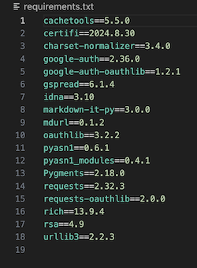

- Create an account on Heroku
- Click on the `Create New App` button

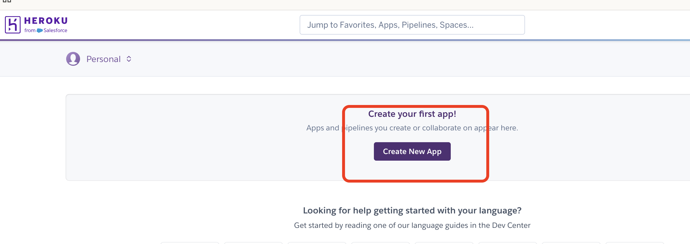

- Provide an app name and choose location: Europe for residents of Europe.

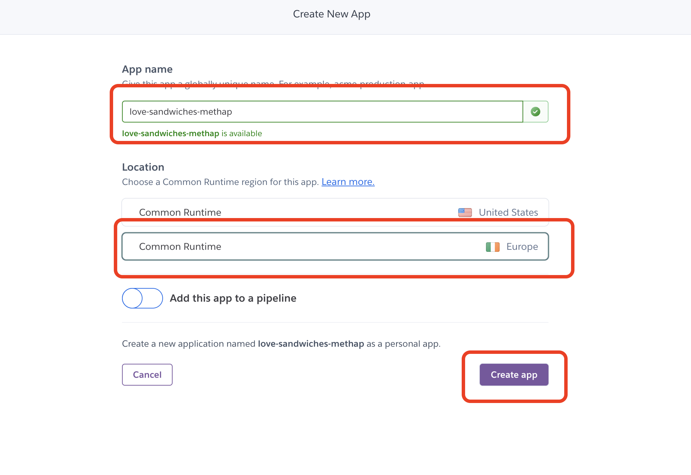

- Go to `Settings` tab.

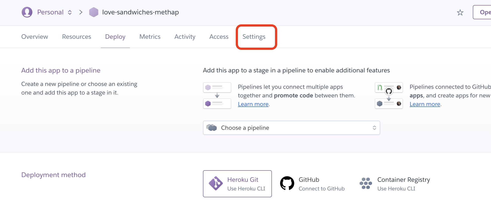

- In the `Config Vars` section, click on `Reveal Config Vars` button.

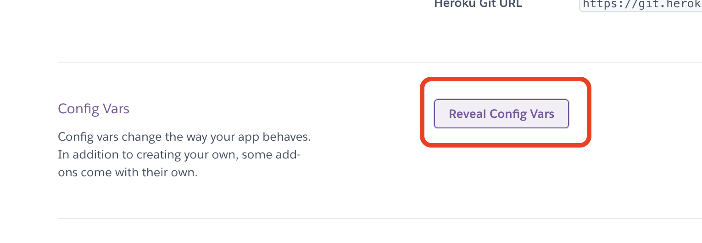

- In the `KEY` field, type in capital letters `CREDS`. In the `VALUE` field, copy-paste the contents of the `creds.json` file

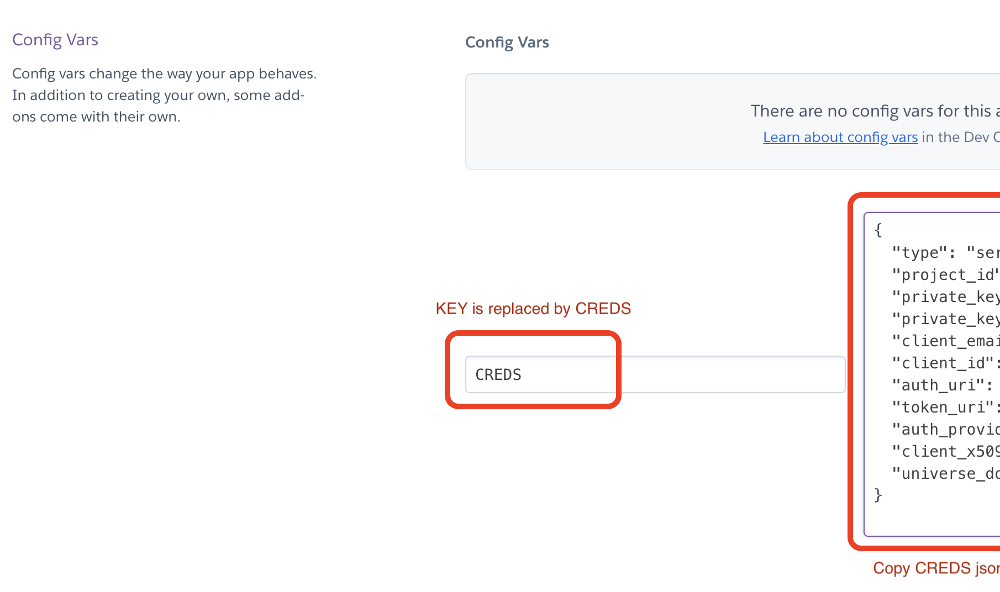

- In the new `KEY` field that appears below, type `PORT` and type `8000` in the corresponding value field

- Click `Add buildpack` button. Two buildpanks will be needed:
  
  1. `heroku/python`
  2. `heroku/nodejs`

    Ensure that Python is listed before nodejs.

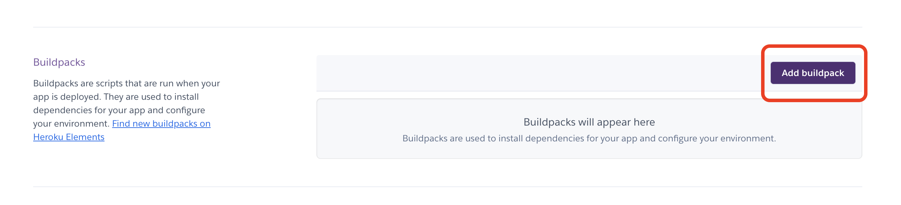

- Find and select `python` from the officially supported buildpacks. Click `Add buildpack` button.

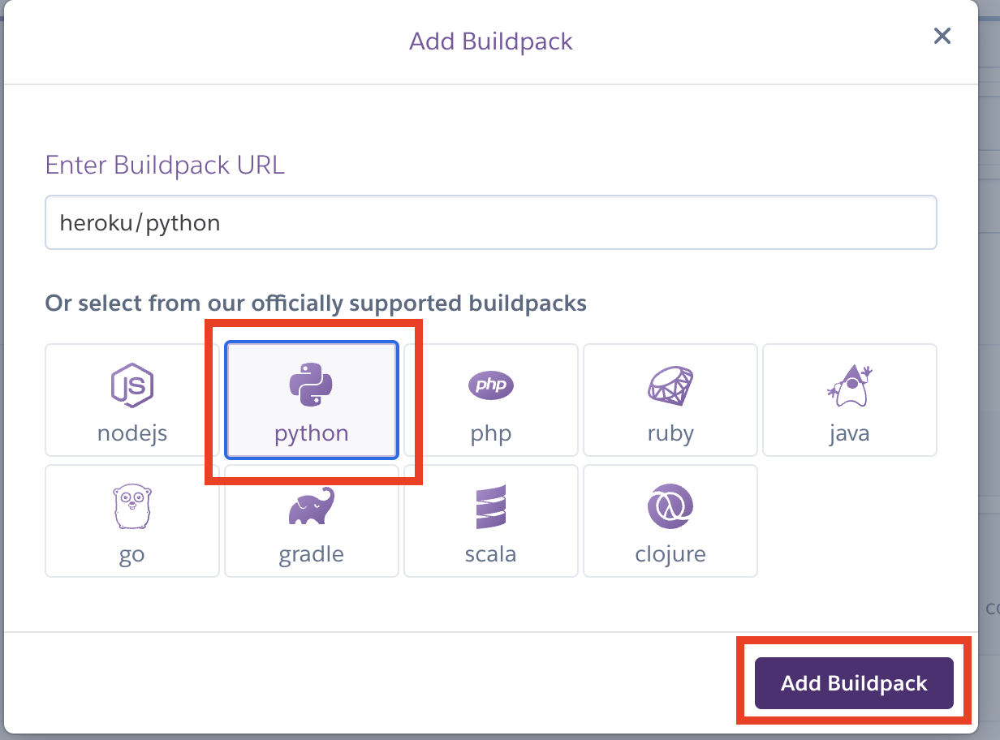

- Do the same for `nodejs`.

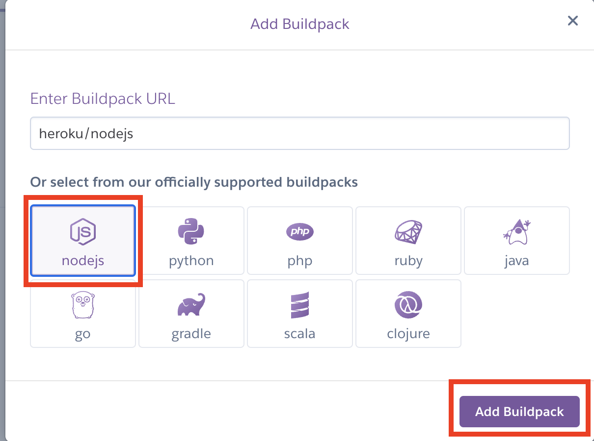

- Go to `Deploy` tab on top. Choose `GitHub` as the `Deployment method`. Heroku will try to establish a conneciton with GitHub account. Authorize the connection.

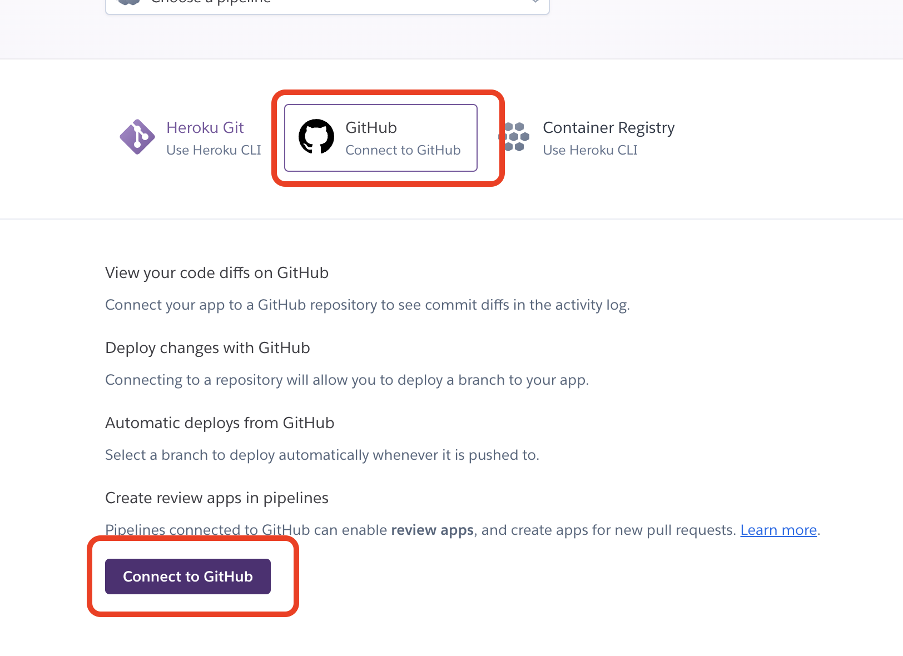

- Search for the repository name that you want to deploy and click `connect`.

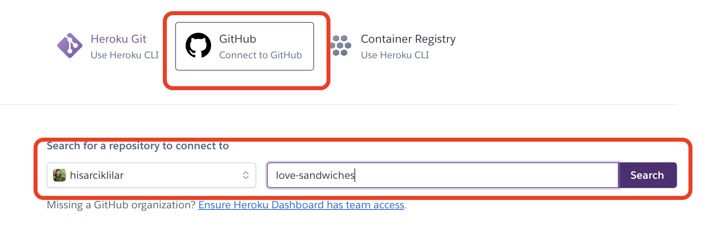

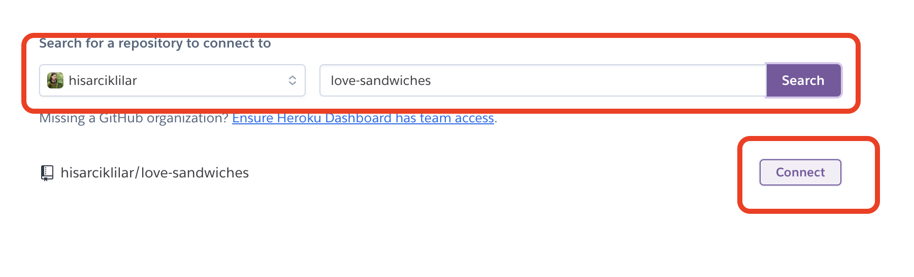

- Choose `Deploy branch` for manual deployment, where one can see the progress of deployment. Click `Enable Automatic Deploys` for automatic deplomyment. This will update the files as GitHub is being updated.

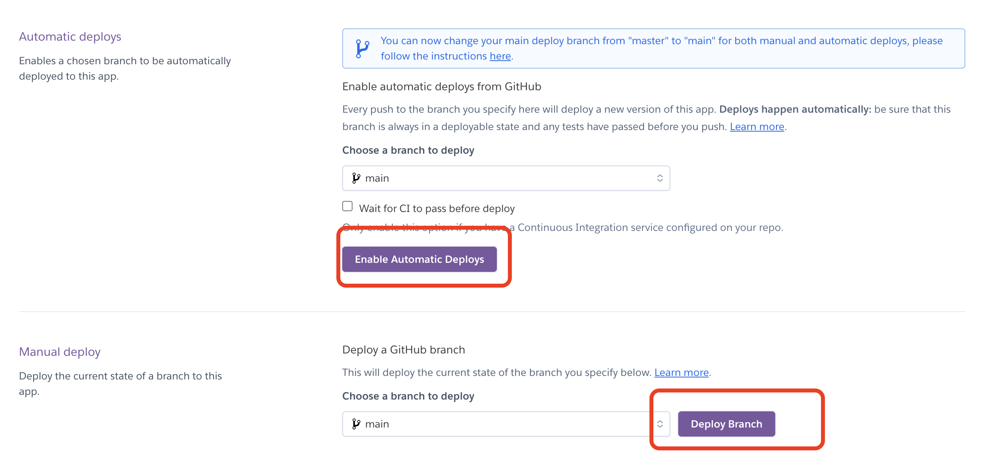
